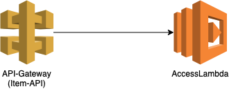

# Welcome to your CDK TypeScript project

This is a simple apigateWithStepfunction patten with API-Gate with synchronous call of lambda

The `apigateWithStepfunction.json` file tells the CDK Toolkit how to execute your app.

## Useful commands

* `npm run build`   compile typescript to js
* `npm run watch`   watch for changes and compile
* `npm run test`    perform the jest unit tests
* `apigateWithStepfunction deploy`      deploy this stack to your default AWS account/region
* `apigateWithStepfunction diff`        compare deployed stack with current state
* `apigateWithStepfunction synth`       emits the synthesized CloudFormation template
